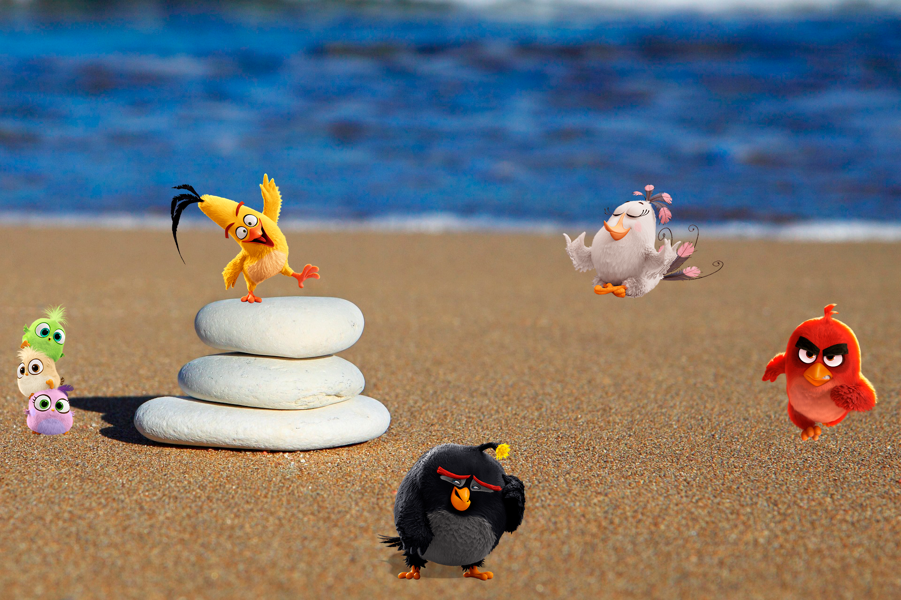

# Ejercicio-Flex

Ejercicio básico de Flexbox:

1- Representa la escena acomodando a los personajes en la playa. Recuerda pensar en los contenedores de estos elementos como cajas para poder mover los ítems.
2- Además, ten en cuenta que la imagen de fondo es justamente eso: un background-image.
3- Debe estar posicionado con Flexbox (excluyente).

Ya que la imagen de fondo es 1920x1280 resolvi el ejercisio de forma tal que con una resolucion 1920x1280 el ejercisio quede como en el resultado final.